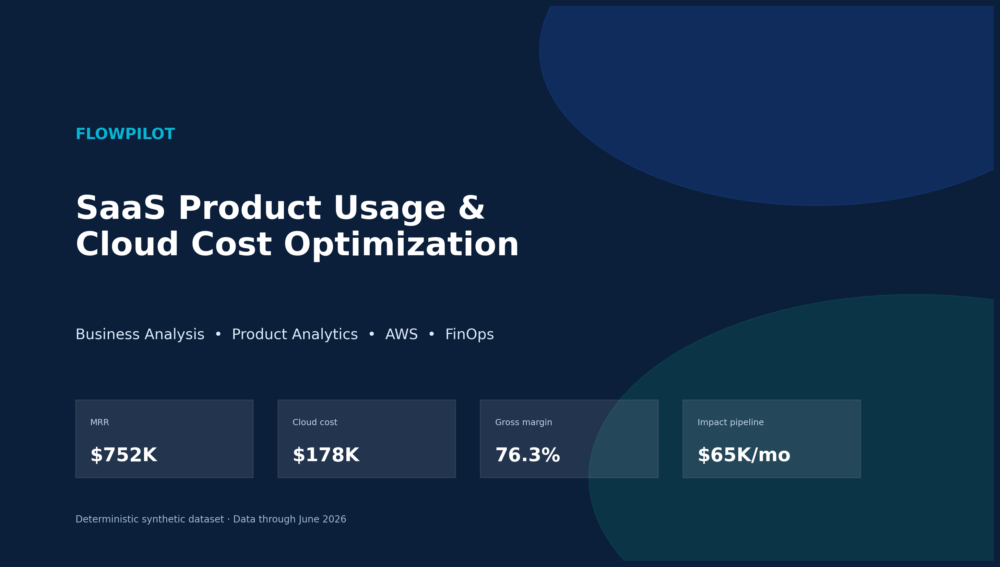
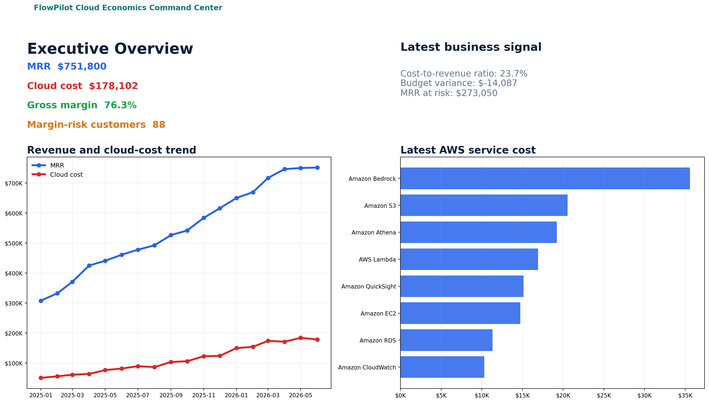
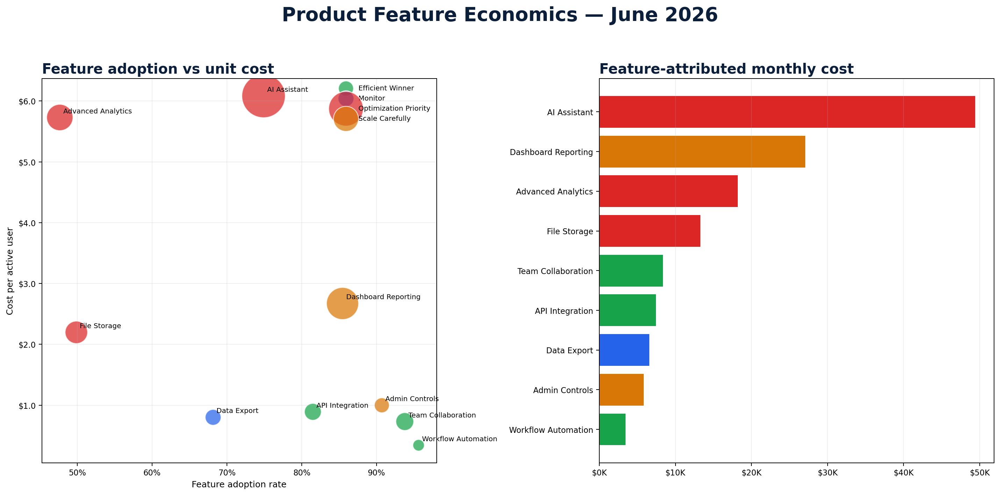
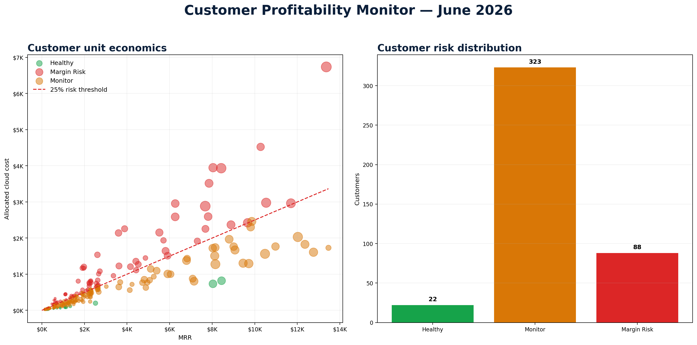
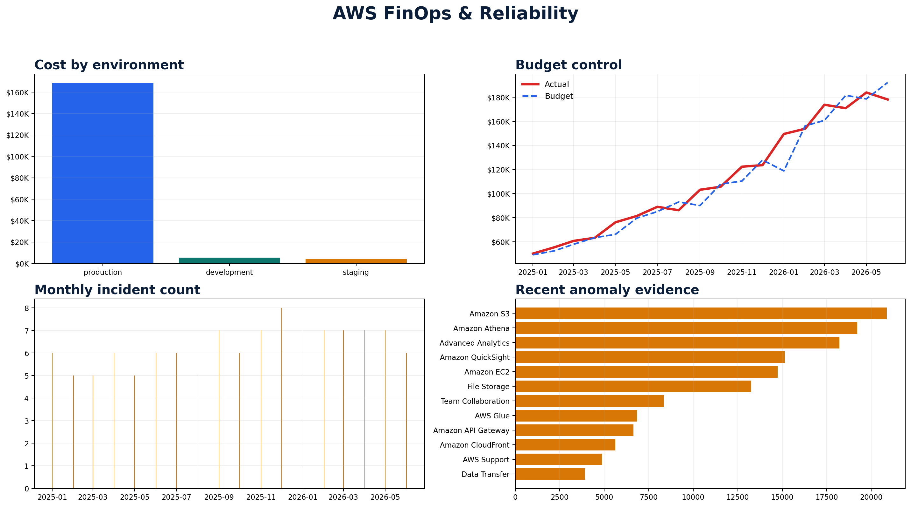

<p align="center"></p>

# FlowPilot — SaaS Product Usage & Cloud Cost Optimization

[](https://github.com/weiyu1029/flowpilot-saas-cloud-economics/actions/workflows/ci.yml)


A recruiter-ready portfolio project that connects **SaaS product adoption, subscription revenue, AWS-style infrastructure cost, customer unit economics, reliability, and prioritized FinOps actions**.

> **Portfolio disclaimer:** all data and rates are deterministic synthetic examples. This is not an AWS bill estimate or audited financial model.

> **GitHub repository:** `weiyu1029/flowpilot-saas-cloud-economics`

## Why this project exists
A cloud bill tells you where money was spent; it does not automatically tell you which product feature, customer, or business decision created value. FlowPilot answers that missing layer for Product, Finance, Customer Success, Engineering, and executives.

## Latest portfolio snapshot — June 2026

| MRR | Cloud cost | Cost / revenue | Est. gross margin | Margin-risk customers | MRR at risk |
|---:|---:|---:|---:|---:|---:|
| $751,800 | $178,102 | 23.7% | 76.3% | 88 | $273,050 |

## Dashboard

### Executive Overview


### Feature Economics


### Customer Profitability


### AWS FinOps & Reliability


## Seven stakeholder views
1. **Executive Overview** — MRR, cloud cost, margin, budget, risk, and revenue-vs-cost diagnostics.
2. **Feature Economics** — adoption, cost per active user, cost share, growth, and investment quadrant.
3. **Customer Profitability** — allocated cost, cost-to-revenue ratio, customer health, and pricing-review candidates.
4. **AWS FinOps & Reliability** — service/environment cost, budget performance, incidents, and anomaly evidence.
5. **Optimization Center** — recommendations ranked by impact, effort, confidence, owner, and risk.
6. **Data & Architecture** — architecture, data model, quality checks, and downloads.
7. **Insights Copilot** — explainable natural-language answers without API keys.

## Architecture


The checked-in app reads curated Parquet/CSV for deterministic deployment. The documented target implementation uses **Amazon S3, AWS Lambda or Glue, Glue Data Catalog, Athena, CloudWatch, SNS, AWS Budgets, IAM, and optional Claude/OpenAI/Amazon Bedrock grounding**.

## Data scale

| Dataset | Rows |
|---|---:|
| Customers | 480 |
| Subscription customer-months | 6,307 |
| Product usage customer-feature-months | 39,561 |
| Cloud cost allocation rows | 121,538 |
| Infrastructure service/environment-months | 439 |
| Curated customer-months | 6,307 |
| Curated feature-months | 150 |
| Data-quality checks | 19 (19 PASS) |

## Key findings
- **AI Assistant** is the largest direct feature-cost pool at $49,396/month.
- **88** customers exceed the synthetic 25% cloud-cost-to-revenue threshold.
- The latest month is **$14,087 under budget**, but service, environment, and feature views still reveal optimization work.
- Eight recommendations represent a synthetic **$64,708/month** impact pipeline.

See [Findings and Recommendations](docs/findings_and_recommendations.md).

## Quick start

```bash
git clone https://github.com/weiyu1029/flowpilot-saas-cloud-economics.git
cd flowpilot-saas-cloud-economics
python -m venv .venv
source .venv/bin/activate          # Windows: .venv\Scripts\activate
pip install -r requirements.txt
streamlit run streamlit_app.py
```

The app opens at `http://localhost:8501`.

### macOS convenience
- Double-click `RUN_LOCAL_MAC.command` to create a virtual environment and launch the app.
- After creating the GitHub repository, double-click `PUBLISH_AND_OPEN_STREAMLIT_MAC.command` to push and open Streamlit Community Cloud.
- See [macOS Setup](docs/mac_setup.md).

## Rebuild the synthetic data

```bash
python scripts/run_pipeline.py
pytest -q
```

## Engineering quality
- Deterministic synthetic generator and curated analytics pipeline.
- CSV + Parquet outputs.
- Data-quality, metric, and seven-page Streamlit smoke tests.
- GitHub Actions CI.
- Dockerfile and Makefile.
- Secrets-free default deployment.
- Security, cost, architecture, ADR, interview, and demo documentation.

## Deploy to Streamlit Community Cloud
1. Push the repository to GitHub.
2. In Streamlit Community Cloud, create an app from the repo.
3. Select branch `main` and entrypoint `streamlit_app.py`.
4. Deploy; no secrets are required for the current version.

Detailed instructions: [Streamlit Deployment](docs/streamlit_deployment.md).

## Documentation index
- [Business Requirements](docs/business_requirements.md)
- [Stakeholder Map](docs/stakeholder_map.md)
- [User Stories](docs/user_stories.md)
- [KPI Dictionary](docs/kpi_dictionary.md)
- [Data Dictionary](docs/data_dictionary.md)
- [Architecture](docs/architecture.md)
- [AWS Implementation](docs/aws_implementation.md)
- [Security & Cost](docs/security_and_cost_considerations.md)
- [Findings & Recommendations](docs/findings_and_recommendations.md)
- [Limitations](docs/limitations.md)
- [Interview Guide](docs/interview_guide.md)
- [Demo Script](docs/demo_script.md)
- [Project Plan](docs/project_plan.md)

## Skills demonstrated
`Business analysis` · `Product analytics` · `FinOps` · `SaaS metrics` · `AWS` · `Python` · `Pandas` · `SQL concepts` · `Streamlit` · `Plotly` · `Data modeling` · `Data quality` · `CI/CD` · `Cloud security` · `Cost optimization` · `Stakeholder communication`

## License
MIT. See [LICENSE](LICENSE).
