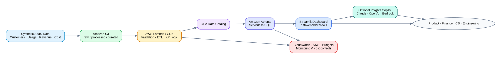

# Architecture

## Portfolio implementation
The live Streamlit portfolio reads curated Parquet/CSV files checked into the repository. This makes the demo deterministic, inexpensive, fast to deploy, and free of cloud credentials.

## Target AWS implementation
1. Synthetic or source-system files land in encrypted Amazon S3 `raw/`.
2. AWS Lambda or AWS Glue validates schema, transforms records, and writes columnar Parquet to `curated/`.
3. AWS Glue Data Catalog stores table metadata.
4. Amazon Athena queries S3 through a workgroup with an enforced output location and bytes-scanned limit.
5. Streamlit or Amazon QuickSight presents stakeholder views.
6. Amazon CloudWatch captures logs/metrics; SNS sends alerts; AWS Budgets monitors spend.
7. IAM roles enforce least privilege; S3 Block Public Access and encryption protect data.

## Why serverless-first
- Usage is intermittent and portfolio-scale.
- Operational overhead is lower than always-on EC2/RDS.
- Cost units are measurable: requests, duration, bytes scanned, storage, and users.
- It maps directly to Cloud Practitioner concepts while preserving a credible upgrade path.

## Production evolution
- Use AWS Organizations / IAM Identity Center for workforce access.
- Add Lake Formation for governed table/column permissions.
- Move large BI workloads to Redshift Serverless when Athena is no longer cost/performance efficient.
- Add EventBridge/Step Functions for orchestration and retry logic.
- Use Bedrock Knowledge Bases or a controlled external model API for grounded generative insights.
